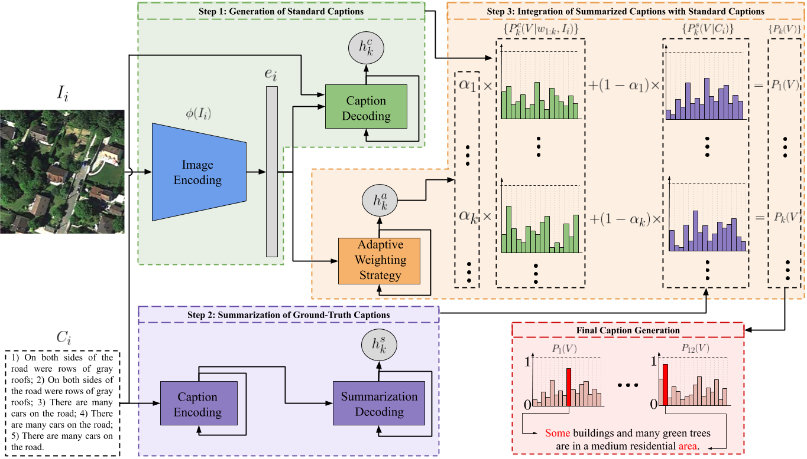

# SD-RSIC: Summarization Driven Deep Remote Sensing Image Captioning
This repository contains code of the paper `SD-RSIC: Summarization Driven Deep Remote Sensing Image Captioning` accepted at IEEE Transactions on Geoscience and Remote Sensing. 
This work has been done at the [Remote Sensing Image Analysis group](https://www.rsim.tu-berlin.de/menue/remote_sensing_image_analysis_group/) by 
[Gencer Sumbul](http://www.user.tu-berlin.de/gencersumbul/), Sonali Nayak and [Begüm Demir](https://begumdemir.com/).

If you use this code, please cite our paper given below:

> G. Sumbul, S. Nayak and B. Demіr, "[SD-RSIC: Summarization Driven Deep Remote Sensing Image Captioning](https://arxiv.org/abs/2006.08432)", IEEE Transactions on Geoscience and Remote Sensing, vol. 59, no. 8, pp. 6922-6934, 2021, doi: 10.1109/TGRS.2020.3031111.

```
@article{SD-RSIC,
  author={G. {Sumbul} and S. {Nayak} and B. {Demіr}},
  journal={IEEE Transactions on Geoscience and Remote Sensing}, 
  title={SD-RSIC: Summarization Driven Deep Remote Sensing Image Captioning}, 
  year={2021},
  volume={59},
  number={8},
  pages={6922-6934},
  doi={10.1109/TGRS.2020.3031111}}
}
```



## Prerequisites
* [PyTorch](https://pytorch.org/), [torchvision](https://pytorch.org/docs/stable/torchvision/index.html), [Pillow](https://pillow.readthedocs.io/en/stable/index.html), 
[tqdm](https://tqdm.github.io/) and [NLTK](https://www.nltk.org/) packages should be installed. The code is tested with Python 3.7.4, PyTorch 1.4.0, torchvision 0.5.0, Pillow 6.1.0, 
tqdm 4.36.1, NLTK 3.5 and Ubuntu 18.04.3.  
* One of the [RSICD](https://github.com/201528014227051/RSICD_optimal), [Sydney-Captions](https://pan.baidu.com/s/1hujEmcG#list/path=%2F) and [UCM-Captions](https://pan.baidu.com/s/1mjPToHq#list/path=%2F) datasets should be downloaded.
* The pre-trained summarization model should be available. To train the pointer-generator model (defined [here](https://git.tu-berlin.de/rsim/SD-RSIC/-/blob/master/summarization/models.py)) for summarization, you can use [this GitHub repository](https://github.com/rohithreddy024/Text-Summarizer-Pytorch).
* Both the training and evaluation scripts except json files for the configuration arguments. Below, the arguments associated with training and evaluation are written, respectively.

## Training
* `exp_name`: Name of the experiment used while saving the model checkpoints.
* `images_dir`: Image directory of a dataset.
* `captions_file`: JSON file of a dataset that includes the captions of images.
* `vocabulary_path`: TXT file that includes vocabulary words. The vocabulary used during our experiments is provided in [vocab.txt](https://git.tu-berlin.de/rsim/SD-RSIC/-/blob/master/vocab.txt) file.
* `vocabulary_size`: Number of words used in the vocaulary.
* `emb_dim`: Image embedding size. 
* `decoder_dim`: Decoder dimension for the first step of the SD-RSIC (Generation of Standard Captions).
* `embed_model`: CNN model name used in the SD-RSIC: resnet34, resnet50, resnet101, resnet152, vgg16, vgg19, inceptionv1, inceptionv3, densenet121, densenet169 or densenet201.
* `epochs`: The number of epochs for the training.
* `batch_size`: Batch size used during training.
* `decoder_lr`: The initial learning rate of the training.
* `print_freq`: Print frequency for the training.
* `checkpoints_path`: The directory path where the model checkpoints will be saved.
* `results_file`: The JSON file path where the information of training procedure will be saved.
* `summarization_model_path`: The pre-trained model path of the summarization model. 

## Evaluation
* `exp_name`: Name of the experiment used while loading the model checkpoint.
* `images_dir`: Image directory of a dataset.
* `captions_file`: JSON file of a dataset that includes the captions of images.
* `vocabulary_path`: TXT file that includes vocabulary words. The vocabulary used during our experiments is provided in [vocab.txt](https://git.tu-berlin.de/rsim/SD-RSIC/-/blob/master/vocab.txt) file.
* `vocabulary_size`: Number of words used in the vocaulary.
* `emb_dim`: Image embedding size. 
* `decoder_dim`: Decoder dimension for the first step of the SD-RSIC (Generation of Standard Captions).
* `embed_model`: CNN model name used in the SD-RSIC: resnet34, resnet50, resnet101, resnet152, vgg16, vgg19, inceptionv1, inceptionv3, densenet121, densenet169 or densenet201.
* `batch_size`: Batch size used during evaluation.
* `checkpoints_path`: The directory path where the model checkpoint will be searched.
* `results_file`: The JSON file path where the resulting image captions will be saved. The suffix of '_test' will be added to the filename.

## Authors
**Gencer Sümbül**
http://www.user.tu-berlin.de/gencersumbul/

**Sonali Nayak**

## License
The code in this repository to facilitate the use of the `SD-RSIC: Summarization Driven Deep Remote Sensing Image Captioning` is licensed under the **MIT License**:

```
MIT License

Copyright (c) 2020 The Authors of The Paper, "SD-RSIC: Summarization Driven Deep 
Remote Sensing Image Captioning"

Permission is hereby granted, free of charge, to any person obtaining a copy
of this software and associated documentation files (the "Software"), to deal
in the Software without restriction, including without limitation the rights
to use, copy, modify, merge, publish, distribute, sublicense, and/or sell
copies of the Software, and to permit persons to whom the Software is
furnished to do so, subject to the following conditions:

The above copyright notice and this permission notice shall be included in all
copies or substantial portions of the Software.

THE SOFTWARE IS PROVIDED "AS IS", WITHOUT WARRANTY OF ANY KIND, EXPRESS OR
IMPLIED, INCLUDING BUT NOT LIMITED TO THE WARRANTIES OF MERCHANTABILITY,
FITNESS FOR A PARTICULAR PURPOSE AND NONINFRINGEMENT. IN NO EVENT SHALL THE
AUTHORS OR COPYRIGHT HOLDERS BE LIABLE FOR ANY CLAIM, DAMAGES OR OTHER
LIABILITY, WHETHER IN AN ACTION OF CONTRACT, TORT OR OTHERWISE, ARISING FROM,
OUT OF OR IN CONNECTION WITH THE SOFTWARE OR THE USE OR OTHER DEALINGS IN THE
SOFTWARE.
```
