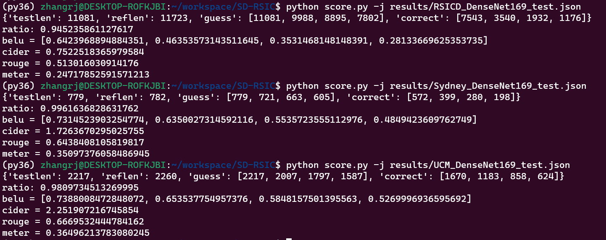
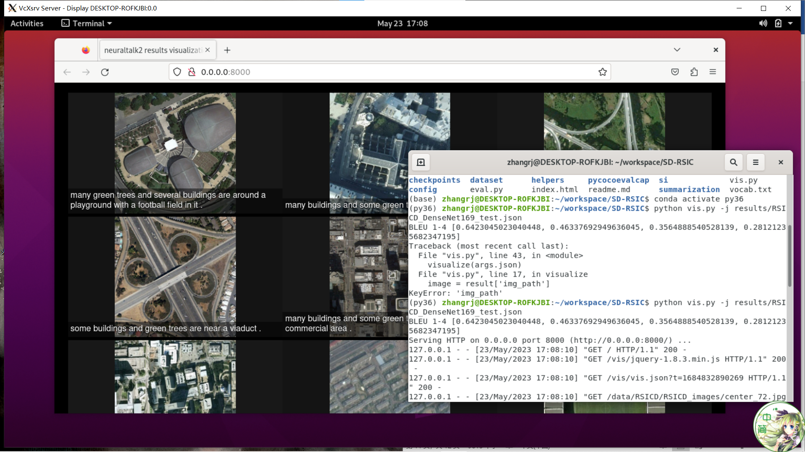

## 运行方式

Ubuntu20.04

python version：python3.7

cuda：11.3 with gpu

torch：

### 文件结构

D:.
├─backup
├─checkpoints		<font color=#0099ff size=5 face="黑体">模型位置</font> 
├─config
├─data		<font color=#ff0000 size=5 face="黑体">数据集位置</font> 
│  ├─RSICD
│  │  └─RSICD_images
│  ├─Sydney_captions
│  │  └─imgs
│  └─UCM_captions
│      └─imgs
├─dataset	<font color=#3333ff size=5 >dataloader代码</font> 
├─examples	<font color=#3333ff size=5 >放置score.py的中间文件</font> 
├─figure
├─helpers	<font color=#3333ff size=5 >训练、评估调用的代码</font> (train.py和eval.py)
├─models
├─pycocoevalcap	<font color=#3333ff size=5 >评估分数调用的代码与配置</font> (score.py)
│  ├─bleu
│  │  └─__pycache__
│  ├─cider
│  │  └─__pycache__
│  ├─meteor
│  │  ├─data
│  │  └─__pycache__
│  ├─rouge
│  │  └─__pycache__
│  ├─spice
│  │  ├─lib
│  │  ├─tmp
│  │  └─__pycache__
│  └─__pycache__
├─results	<font color=#ff0000 size=5 face="黑体">输出的eval.py内容的位置</font> 
├─si
│  └─SD-RSIC.si4project
│      ├─Backup
│      └─cache
│          └─parse
├─summarization	<font color=#3333ff size=5 >放置0120000.tar</font> 
└─vis

### 预训练的总结模型文件

0120000.tar和vocab.txt

### 数据集

https://github.com/201528014227051/RSICD_optimal

RSICD、UCM、Sydney的caption数据集均可以在上面的github页面下载

(本身太大，没有打包)

image放在data文件夹里面对应的imgs文件夹里面(RSICD是RSICD_images文件夹)

json文件放在对应的数据集文件夹即可

### 写配置文件

### 训练（train）

```shell
1:
python train.py
#读取默认的config

2:
python train.py ./config/config_ucm.json
#指定config训练
```

训练记录输出在：results文件夹中，是json文件

模型输出在：checkpoints文件夹中，以best开头的是最佳的

### 评估（evaluation）

```shell
1:
python eval.py
#读取默认的config

2:
python eval.py ./config/config_ucm.json
#指定config评估
```

在results文件里面生成测试集的结果：是一个json文件，以test结尾

```shell
三种评估：
python eval.py ./config/config_rsicd.json
python eval.py ./config/config_sydney.json
python eval.py ./config/config_ucm.json
```

### 评估分数（score）

```shell
python score.py -j results/_test.json
需要指定计算哪个：
不指定时：读取results文件夹下RSICD_DenseNet169_test.json

输出大致如下：
{'testlen': 779, 'reflen': 782, 'guess': [779, 721, 663, 605], 'correct': [572, 399, 280, 198]}
ratio: 0.9961636828631762
belu = [0.7314523903254774, 0.6350027314592116, 0.5535723555112976, 0.4849423609762749]
cider = 1.7263670295025755
rouge = 0.6438408105819817
meter = 0.35097376058486945
```

针对三种数据集的评估分数：

```shell
python score.py -j results/RSICD_DenseNet169_test.json

python score.py -j results/Sydney_DenseNet169_test.json

python score.py -j results/UCM_DenseNet169_test.json
```

三者分数分别为

```shell
{'testlen': 11081, 'reflen': 11723, 'guess': [11081, 9988, 8895, 7802], 'correct': [7543, 3540, 1932, 1176]}
ratio: 0.945235861127617
belu = [0.6423968894884351, 0.46353573143511645, 0.3531468148148391, 0.28133669625353735]
cider = 0.7522518365979584
rouge = 0.513016030914176
meter = 0.24717852591571213
```

```shell
{'testlen': 779, 'reflen': 782, 'guess': [779, 721, 663, 605], 'correct': [572, 399, 280, 198]}
ratio: 0.9961636828631762
belu = [0.7314523903254774, 0.6350027314592116, 0.5535723555112976, 0.4849423609762749]
cider = 1.7263670295025755
rouge = 0.6438408105819817
meter = 0.35097376058486945
```

```shell
{'testlen': 2217, 'reflen': 2260, 'guess': [2217, 2007, 1797, 1587], 'correct': [1670, 1183, 858, 624]}
ratio: 0.9809734513269995
belu = [0.7388008472848072, 0.653537754957376, 0.5848157501395563, 0.5269996936595692]
cider = 2.251907216745854
rouge = 0.6669532444784162
meter = 0.36496213783080245
```

注意：该在windows上meter计算可能会失败，建议使用linux



### 可视化网页（html）

与评估分数相同

```shell
python vis.py -j results/_test.json
需要指定生成哪一个网页：
不指定时：读取results文件夹下RSICD_DenseNet169_test.json

然后使用浏览器打开：http://localhost:8000/
linux需要打开http://0.0.0.0:8000/
```

针对三种数据集生成网页过程：

```shell
python vis.py -j results/RSICD_DenseNet169_test.json

python vis.py -j results/Sydney_DenseNet169_test.json

python vis.py -j results/UCM_DenseNet169_test.json

但是由于另外两个数据集是tif格式，这种方式可视化的结果只有这一个
```

例如：



但是由于另外两个数据集是tif格式，这种方式可视化的结果只有这一个
